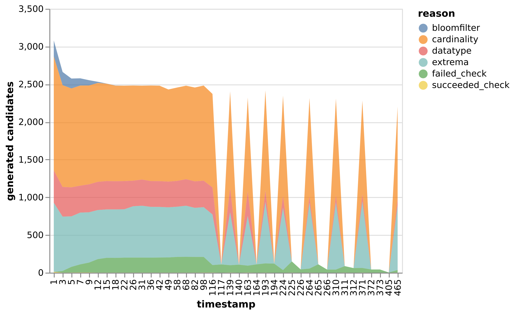

# Zusammenfassung

Wir haben ein verteiltes System für das Finden von IND's in dynamisch wachsenden Datensets implementiert. Außerdem wurde ein Datengenerator erstellt, mit dem wir die Generierung von dynamischen Daten simulieren. Diese wachsenden Daten werden genutzt um darauf INDs zu suchen.

Unsere Lösung ist insofern verteilt, als dass das Speichern von Tabellenwerten und das Prüfen von IND-Kandidaten auf mehrere Data-Nodes verteilt werden kann. Das Einlesen von Datensätzen und das Generieren von IND-Kandidaten ist noch auf einen einzelnen Master-Node beschränkt. 

Der Datengenerator und das verteilte System lassen sich unabhängig voneinander Ausführen, dazu sind zahlreiche Konfigurationsmöglichkeiten gegeben (siehe [Benutzerdokumentation](#benutzerdokumentation)).  Wir prüfen die Ergebnisse unserer Lösung gegen ein alte Version unserer Code-Base (siehe [Entwicklerdokumentation - Testen](#testen))). Die Performance unserer Lösung wird weiterhim verglichen zu einer Spark-Implementation des SINDY-Algorithmus (siehe [Evaluation](#evaluation)).

__Fazit unserer Evaluation__ ist, dass unsere Lösung bei statische Datensätzen schlechter performt als der SINDY-Algorithmus. Bei dynamische Datensätze hingegen degradiert unsere Performance nur wenig (~10%  Durchsatz-Degration bei 50% Löschungen). Vergrößern wir unsere Datensätze, so verbessert sich der Durchsatz - scheinbar steigen unsere Ausführungszeiten logarithmisch mit der Input-Größe statt linear. Dies müsste man aber noch weiter auf leistungsstärkeren Host-System erproben.

## Evaluation

Wir haben verschiedene Konfigurationen unserer Lösungen auf dem TPC-H Datensatz ausgeführt und die Ergebnisse visualisiert.

Die __Live-Results__ zeigen, wieviele IND-Kandidaten zu jedem Zeitpunkt (neu-)generiert wurden und wie sie behandelt wurden. Um mehr über die Pruning-Pipeline und verschiedenen Pruning-Methoden zu lernen, siehe [Algorithmenenwurf - Pruning Pipeline](#pruning-pipeline)

Die __System-Benchmarks__ zeigen die CPU- und RAM-Auslastung des Host-Systems während einer Ausführung. Alle Ausführungen fanden auf einem __Intel(R) Core(TM) i7-1165G7 (2.8GHz Clockspeed, 4 Cores, 8 Threads)__ mit __16GB DDR4 RAM__ statt.

Die __Ausführungszeiten__ wurden zusätzlich mit dem UNIX `time` Tool gemessen. _Real-Time_ beschreibt die Ausführungszeit von Anfang bis Ende. _User-Time_ beschreibt die CPU-Zeit über mehrere Threads/Prozesse hinweg.

|Konfiguration|Erklärung|Input-Größe|Real-Time (secs)|User-Time (secs)|Durchsatz (MB/s)|
|--|--|-|-|-|-|
|`TPCH-static`|Statischer Datensatz|415MB|116|447|3.57|
|`TPCH-spark`|Statischer Datensatz, Spark Implementation|415MB|68|408|6.1|
|`TPCH-del10`|Dynamischer Datensatz, 10% Löschungen|415MB|122|503|3.4|
|`TPCH-del50`|Dynamischer Datensatz, 50% Löschungen|415MB|129|502|3.2|
|`TPCH-repeat300-del10`|Dynamischer Datensatz mit Wiederholung bis 300MB pro Datei, 10% Löschungen|2.1GB|305|1682|6.85|
|`TPCH-moutate300-del10`|Dynamischer Datensatz mit Mutation bis 300MB pro Datei, 10% Löschungen|2.1GB|471|3142|4.46|

: Tabelle: Überblick der verschiedenen System-Konfigurationen und einmalig-gemessene Ausführungszeiten (UNIX `time`). 

##### TPCH-static (Statischer Datensatz) {-}

Im statischen Fall lesen wir den Datensatz einmal ohne Löschungen ein. Der Durchsatz in diesem Fall liegt bei 3.57MB/s.

{width=80%}

Zu Beginn wurden 3000 Kandidaten generiert, wovon die allermeisten geprunt werden konnten. In nachfolgenden Durchläufen wurden typischerweise 50-25% der Kandidaten re-generiert und auch in den allermeisten Fällen erfolgreich geprunt.

{width=70%}

Die System-Benchmark zeigt, dass sowohl RAM als auch CPU besser ausgenutzt werden könnten. Der RAM-Auslastung steigt bis zu ~75% an (12GB), was für eine Input-Größe von 415MB nicht verhältnismäßig ist. Die CPU-Auslastung liegt im Mittel etwa bei 50%, mit zunehemend stärker-werdenden Schwingungen. 

Die Text-Logs des Akka-Systems zeigten, dass die Ausführung häufig auf ein paar wenige Data-Worker warten musste. Wir vermuten, dass man mit zusätzlicher [horizontaler Partitionierung (Aufteilung nach Zeilen)](#horizontale-partitionierung) man eine bessere Auslastung erzielen würde.

##### TPCH-spark (Statischer Datensatz, Spark Implementation) {-}

Die Spark-Implementation des SINDY-Algorithmus zeigt im statischen Fall einen höheren Durchsatz von 6.1MB/s (im Vergleich zu den 3.57/MBs unserer Lösung). 

{width=70%}

Die System-Benchmark zeigt eine bessere CPU-Auslastung, was vermutlich auf die hohe Verteilbarkeit des SINDY-Algorithmus und dem schlauen Partitionieren des Spark-Frameworks zurückzuführen ist.

Die RAM-Auslastung pendelt sich auf ~30% (5GB) ein. Wir vermuten, dass es darauf zurückzuführen ist, dass wir in unserer Lösung alle Daten zwischenspeichern und zusätzlich viel Daten-Redundanz haben (siehe [DataWorker](#dataworker)), während die Spark-Implementation Input-Daten und Zwischenergebnisse verwirft.

##### TPCH-del10 (Dynamischer Datensatz, 10% Löschungen) {-}

Löschen wir während der Ausführung 10% der Einträge, so scheint das nur wenig Auswirkungen auf den Durchsatz zu haben: von 3.57MB/s im statischen Fall (`TPCH-static`) zu 3.4MB/s im dynamischen Fall.

{width=80%}

Die Live-Results zeigen, dass es häufiger zu gescheiterten Subset-Checks kam. Es scheint, dass die Pruning-Methoden hier weniger häufig greifen.

{width=70%}

Die System-Benchmark zeigt eine ähnliche Auslastung zu `TPCH-static`.

##### TPCH-del50 (Dynamischer Datensatz, 50% Löschungen) {-}

Löschen wir während der Ausführung 50% der Einträge, sinkt der Durchsatz von 3.57MB/s im statischen Fall (`TPCH-static`) zu 3.2MB/s im dynamischen Fall.

{width=80%}

DIe Live-Results sind ähnlich zu dem dynamischen Fall mit 10% Löschungen (`TPCH-del10`).

{width=70%}

Die System-Benchmark zeigt eine ähnliche Auslastung zu `TPCH-static` und `TPCH-del10`.

##### TPCH-repeat300-del10 (Dynamischer Datensatz mit Wiederholung bis 300MB pro Datei, 10% Löschungen) {-}

Mit "Wiederholen" beschreiben wir, dass wir jede CSV-Datei nach vollständigem Einlesen wieder von-vorne einlesen und mit neuen Zeilenpositionen ausgeben (siehe [Datengenerator](#datengenerator)).

Wiederholen wir jede CSV-Datei bis zu 300MB pro Datei (2.1GB Input insgesamt), so zeigt dies eine starke Verbesserung im Durchsatz: von 3.4 MB/s im 415MB Fall (`TPCH-del10`) zu 6.1 MB/s im 2.1GB Fall. Das ist zu erwarten - bereits bekannte Attribut-Werte werden im [Datenfluss](#datenfluss) schnell abgefangen und verursachen überhaupt keine Neu-Generation von Kandidaten.

{width=80%}

Die Live-Results sind sehr ähnlich zu `TPCH-del10` über einen längeren Zeitraum.

{width=70%}

Die System-Benchmark ähnelt `TPCH-del10` über einen längeren Zeitraum mit einer höheren Basis-Auslastung. Das Problem der fehlenden horizontalen Partitionierung (siehe `TPCH-static`) wird hier in immer-länger-werdenden Schwingungen der CPU-Auslastung umso deutlicher. Die maximale RAM-Auslastung von 95% (15.2GB) zeigt im Vergleich zum 415MB Fall (`TPCH-del10`) mit 70% (11.2GB), dass der RAM-Verbrauch logarithmisch steigt. Würde es linear steigen, so würde man ~57GB RAM benötigen. 

##### TPCH-mutate300-del10 (Dynamischer Datensatz mit Mutationen bis 300MB pro Datei, 10% Löschungen) {-}

Mit "Mutieren" beschreiben wir, dass wir jede CSV-Datei nach vollständigem Einlesen wieder von-vorne einlesen und mit neuen Zeilenpositionen ausgeben. Zusätzlich werden alle Werte so modifiziert, dass sie verschieden sind zu der vorherigem Durchlauf (siehe [Datengenerator](#datengenerator)).

Mutieren wir jede CSV-Datei bis zu 300MB pro Datei (2.1GB Input insgesamt), so sinkt der Durchsatz von 6.1 MB/s im 2.1GB Fall mit Wiederholungen (`TPCH-repeat300-del10`) zu 4.46 MB/s im Fall mit Mutationen. Der Durchsatz ist aber immernoch höher als im vergleichbaren 415MB Fall (`TPCH-del10`) mit 3.4 MB/s.

{width=80%}

Die Live-Results zeigen, dass in der ersten Hälfte der Ausführung zu jedem Zeitpunkt etwa 2500 Kandidaten generiert wurden. Das macht Sinn - die Mutationen führen dazu, dass _alle_ Attribute neue Werte erhalten und fortlaufend neu auf INDs geprüft werden müssen.

In der zweiten Hälfte der Ausführungen kommt es zu großen Lücken, in denen hauptsächlich nur gescheiterte Subset-Checks durchgeführt wurden. Wir vermuten, dass es hier zu sehr langwierigen Subset-Checks kam, auf die das System warten musste.

{width=70%}

Die System-Benchmark zeigt eine ähnliche Auslastung wie im vergleichbaren Fall mit Wiederholungen (`TPCH-repeat300-del10`). Überrascht hat uns, dass sich auch die RAM-Auslastung von bis zu 95% sehr ähnelt. Wir hatten erwartet, dass die Ausführung wegen der modifizierten Werte mehr RAM beanspruchen würde, als wir zur Verfügung haben.