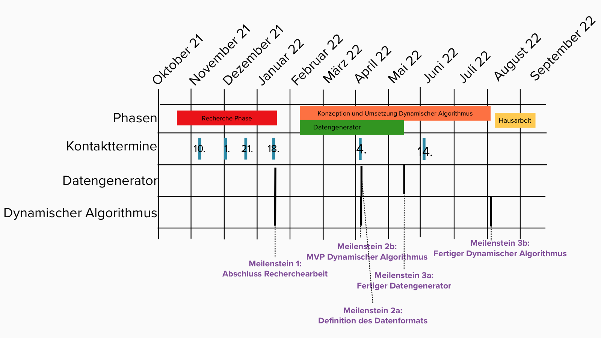

# Zeitplan

**Projektzeitraum: 24.10.2021 - 31.09.2022**

**Aufgabe**:

- Ein verteiltes System entwickeln welches auf dynamischen Datensätzen Inclusion Dependencies findet
- Einen Datengenerator entwickeln der es erlaubt mit zufälligen Daten das verteilte System zu testen

**Projektphasen**:

1. Recherche
2. Konzeptionierung und Umsetzung
  1. Datengenerator
  2. Akka System
3. Ausarbeitung der Hausarbeit

<!--
-->

{width=100%}

<!-- 
-->

## Phase 1: Recherchephase 24.10.2021 - 18.01.2021 {-}

In der Zeit haben wir uns in der Gruppe im Wochentakt getroffen und besprochen. Dazwischen hat jeder für sich recherchiert. Es ging darum zunächst das Thema zu durchdringen und Ideen zu sammeln, wie wir das Ganze umsetzen können. Die Kontakttermine mit Prof. Papenbrock hatten wir im 2 bis 4 Wochentakt. Dort haben wir unsere Ideen vorgestellt und besprochen. Parallel haben wir für das Modul Verteilte Systeme an einer Programmieraufgabe gearbeitet, in der wir mit einem verteilten Algorithmus auf statischen Daten Inclusion Dependencies finden sollten. Dadurch haben wir viel für unsere spätere Aufgabe gelernt.

> **_Meilenstein 1: Abschluss Recherchearbeit_**

>>**Ergebnisse der Phase 1**

>>Nach der Recherchephase haben wir uns auf folgende Aufgaben festgelegt
  >>- Auffinden von unären Inclusion Dependencies in dynamischen Datensätzen
  >>- Ein verteiltes System mit Akka in Java bauen, in dem die Inclusion Dependencies gesucht werden
  >>- Eine Pipeline an Pruningschritten zu bauen um möglichst zeit- und datensparend Kombinationen für Inclusion Dependencies auszuschließen

## Phase 2: Konzeptionierung und Umsetzung 04.04.2022 - 08.08.2022 {-}

In der nächsten Phase sind wir dazu übergegangen uns in größeren Abständen zu Blockwochen oder Sprintwochenenden zu treffen um am Stück runterprogrammieren zu können.

### a) Data-Generator {-}

#### Erste Programmiereinheit: 04.04.2022 - 08.08.2022

In einem einwöchigen Programmiersprint ist das Konzept und ein Großteil des Data-Generators entstanden. Als Datenformat wurden CSV Tabellen festgelegt, wobei die erste Spalte immer eine explizite Zeilen-Position ist, mit der man alte Daten überschreiben kann.

> **_Meilenstein 2a: Definition des Datenformats_**

#### Zweite Programmiereinheit: 21.05.2022

In der zweiten Programmiereinheit wurde der Data-Generator fertiggestellt.

> **_Meilenstein 3a: Fertiger Data-Generator_**

>> **Ergebnis der Phase 2a** 

>> Fertiger Data-Generator

### b) Akka-System {-}

#### Erste Programmiereinheit: 04.04.2022 - 08.04.2022

In einem einwöchigen Programmiersprint sind erste Klassenentwürfe für den Algorithmus entstanden und ein erstes MVP des dynamischen Algorithmus in Form einer Dummy Main.

> **_Meilenstein 2b: MVP Dynamischer Algorithmus_**

#### Zweite Programmiereinheit: 21.05.2022

Ausgehend vom MVP wurden nun die Klassenentwürfe und der Algorithmus iterativ und inkrementell immer wieder angepasst.

#### Programmiereinheit: 01.08.2022 - 08.08.2022

Nachdem die Architektur für den Algorithmus noch einmal überarbeitet wurde, wurde das Akka-System mitsamt seiner Pipeline final implementiert.

> **_Meilenstein 3b: Fertigstellung Akka-System_**

>> **Ergebnis der Phase 2b** 

>> Fertiges Akka-System

## Phase 3: Hausarbeit und Festhalten der Ergebnisse 01.08.2022-31.09.2022 {-}

Parallel zur Fertigstellung des Akka-Systems wurde die Hausarbeit zu der Projektarbeit erstellt. Neben der Dokumentation wurden außerdem graphische Plots der Ergebnisse erstellt.

>> **Ergebnis der Phase 3** 

>> Ausarbeitung und Darstellung der Ergebnisse

