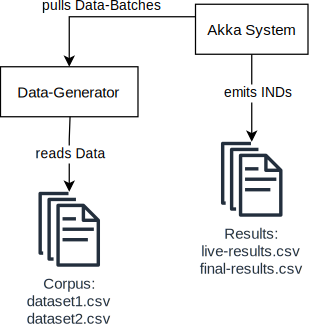

# Definition des Zielsystems

## System-Kontext

Das System spaltet sich in den __Data-Generator__ und in das __Akka System__.

Die Aufgabe des __Data-Generators__ ist, ein synthetisches dynamisches Dataset von beliebiger Länge zu generieren. Dazu liest er Korpus von bestehenden Datasets aus. Die Einträge dieser Datensätze werden wiederholt, umgeordnet, gelöscht und modifiziert als Batches aus Änderungen verpackt.

Weil das Generieren dieser Batches sehr viel günstiger als ihre Analyse sein wird, werden diese Datenbatches vom Empfänger gepullt statt zum Empfänger gepusht (Pull-Architektur statt Push-Architektur).

Die Aufgabe des __Akka Systems__ ist es, Batches aus Änderungen anzunehmen, das synthethische Dataset zu rekonstruieren/updaten und es fortwährend auf INDs zu überprüfen. Dazu pullt es Batches vom Data-Generator so schnell, wie es sie analysieren kann.

Die gefundenen INDs werden im laufenden Betrieb in eine `live-results.csv` Datei ausgegeben. Sobald der Data-Generator keine Data-Batches mehr liefert, wird der finale Zustand der synthethischen Datensets analysiert und alle verbliebenen INDs werden nochmal in eine `final-results.csv` Datei ausgeben.

## Inclusion Dependencies

Inclusion Dependencies beschreiben, ob alle Werte die ein Attribut $X$ annehmen kann auch von Attribut $Y$ angenommen werden können. $X$ und $Y$ können aus Instanzen des gleichen Schemas (= der gleichen Tabelle) stammen, oder auch aus Instanzen zwei verschiedenen Schematas (= verschiedener Tabellen).
Falls das der Fall ist, ist $X$ abhängig von $Y$ und man schreibt $X ⊆ Y$.

Formal bedeutet das: $∀ t_i[X] ∈ r_i, ∃ t_j[Y] ∈ r_j$ mit $t_i[X] = t_j[Y]$ wobei $t_i, t_j$ Schema-Instanzen sind und $X, Y$ Attribute der Schemata. 

Allgemein werden $X$ und $Y$ als Listen von Attributen gesehen, wobei stehts gelten muss $|X| = |Y|$.  
Es wird von *unary* Inclusion Dependencies gesprochen wenn gilt $X ⊆ Y$ mit $|X| = |Y| = 1$. Falls $|X| = |Y| = n$ gilt, handelt es sich um eine *n-ary* Inclusion Dependency.

Für Inclusion Dependencies gelten immer folgende Eigenschaften:

* *Reflexiv:* Es gilt immer $X ⊆ X$
* *Transitiv:* Es gilt $X ⊆ Y \wedge Y ⊆ Z \implies X ⊆ Z$
* *Permutationen:* Es gilt $(X_1, ... , X_n) ⊆ (Y_1, ... , Y_n)$, dann gilt auch $(X_1, ... , X_n) ⊆ (Y_1, ... , Y_n)$ für alle Permutationen σ1, ... , σn 

##### Beispiel für unary Inclusion Dependencies {-}

  
  

  TODO quelle!  
  X := Attribut "Name" aus Tabelle "Lending" 
  Y := Attribut "Titel" aus Tabelle "Book" 
  

Es ist leicht zu sehen, dass alle Werte die "Name" annehmen kann auch in Attribut "Titel" vertreten sind, daher folgt $X ⊆ Y$.  
Es ist auch leicht zu sehen, dass $Y ⊆ X$ nicht gilt, da $Y$ den Wert "3D Computer Graphics" annehmen kann, dieser jedoch nicht in $X$ auftaucht.

##### Beispiel für n-ary Inclusion Dependencies {-}

  
  

  TODO quelle!  
  X := Attribute "Student" und "Course" aus Tabelle "Lending" 
  Y := Attribute "Name" und "Lecture" aus Tabelle "Student" 
  

Bei n-ary Inclusion Dependencies ist es nicht nur wichtig das alle Werte der einzelnen Attribute aus $X$ in $Y$ auftauchen, sondern das sie vor allem in der Kombination in Y auftauchen, in der sie auch in X auftauchen. 
Auch hier ist wieder einfach zu sehen, dass $X ⊆ Y$ gilt, denn die drei unterschiedlichen Kombinationen aus "Student" und "Course" die in $X$ auftauchen sind auch alle in $Y$ vertreten. Das bedeutet also das hier ebenfalls $Y ⊆ X$ gelten würde.

## Datenformat

Ein Datenset besteht aus mehreren __Tabellen__, die unterschiedliche Schematas haben können. Diese Tabellen werden als Stream eingelesen und einzelne Einträge eines Streams (= Zeilen einer Tabelle) können ältere Einträge überschreiben.

<!--
Eine Anforderung an den Algorithmus ist, dass er _Tabellen aus ihren Batches rekonstruiert und updatet_. Dazu muss er eine Repräsentation der Tabellen über die gesamte Ausführung hinweg zwischenspeichern. 
-->

Wir konzipieren unseren Algorithmus so, dass er __Batches aus Änderungen__ einliest. Ein Batch wird immer aus genau einem Input-Stream entnommen und hat das gleiche Schema wie seine Ursprungstabelle, bis auf eine `$` Spalte am Anfang welche die _Position eines Eintrages_ beschreibt.

Änderungen lassen sich in drei Arten unterteilen:

1. Eine __Hinzufügung__ ist ein Änderung, deren Position das Erste mal im Stream auftaucht und bei der _alle Felder_ einen Wert haben.
2. Eine __Modifikation__ ist ein Änderung, deren Position bereits im Stream auftauchte und bei der _alle Felder_ einen Wert haben. Die Position muss dem Eintrag entsprechen, der überschrieben werden soll.
2. Eine __Löschung__ ist ein Änderung, deren Position bereits im Stream auftauchte und bei der _kein Feld_ einen Wert hat. Die Position muss dem Eintrag entsprechen, der gelöscht werden soll.

|$|A|B|C|
|-|--|--|--|
|200|horse|lion|flamingo|
|200|horse|lion|**parrot**|
|200||||

: Tabelle: Beispiel für eine Hinzufügung, Modifikation und Löschung eines Eintrags.

Wir definieren den leeren Zellenwert `NULL` als einen besonderen Marker, der die Abwesenheit eines Wertes beschreiben soll. Der `NULL` Marker muss immer von der Berechnung von Inclusion Dependencies ausgeschlossen werden - also ob ein Attribut fehlen kann oder nicht soll keine Auswirkung auf die gefundenen Inclusion Dependencies haben.

<!-- 
Während der Ausführung soll das System periodisch alle gefundenen Inclusion Dependencies ausgeben. Sollten nach dem Abarbeiten von Änderungen diese Inclusion Dependencies nicht mehr gelten, so soll das auch ausgegeben werden.
-->
