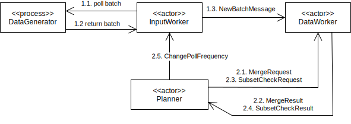

# Definition des Zielsystems

## Inclusion Dependencies

Inclusion Dependencies beschreiben, ob alle Werte die ein Attribut $X$ annehmen kann auch von Attribut $Y$ angenommen werden können. $X$ und $Y$ können aus Instanzen des gleichen Schemas (= der gleichen Tabelle) stammen, oder auch aus Instanzen zwei verschiedenen Schematas (= verschiedener Tabellen).
Falls das der Fall ist, ist $X$ abhängig von $Y$ und man schreibt $X ⊆ Y$.

Formal bedeutet das: $∀ t_i[X] ∈ r_i, ∃ t_j[Y] ∈ r_j$ mit $t_i[X] = t_j[Y]$ wobei $t_i, t_j$ Schema-Instanzen sind und $X, Y$ Attribute der Schemata. 

Allgemein werden $X$ und $Y$ als Listen von Attributen gesehen, wobei stehts gelten muss $|X| = |Y|$.  
Es wird von *unary* Inclusion Dependencies gesprochen wenn gilt $X ⊆ Y$ mit $|X| = |Y| = 1$. Falls $|X| = |Y| = n$ gilt, handelt es sich um eine *n-ary* Inclusion Dependency.

Für Inclusion Dependencies gelten immer folgende Eigenschaften:

* *Reflexiv:* Es gilt immer $X ⊆ X$
* *Transitiv:* Es gilt $X ⊆ Y \wedge Y ⊆ Z \implies X ⊆ Z$
* *Permutationen:* Es gilt $(X_1, ... , X_n) ⊆ (Y_1, ... , Y_n)$, dann gilt auch $(X_1, ... , X_n) ⊆ (Y_1, ... , Y_n)$ für alle Permutationen σ1, ... , σn 

##### Beispiel für unary Inclusion Dependencies {-}

  
  

  TODO quelle!  
  X := Attribut "Name" aus Tabelle "Lending" 
  Y := Attribut "Titel" aus Tabelle "Book" 
  

Es ist leicht zu sehen, dass alle Werte die "Name" annehmen kann auch in Attribut "Titel" vertreten sind, daher folgt $X ⊆ Y$.  
Es ist auch leicht zu sehen, dass $Y ⊆ X$ nicht gilt, da $Y$ den Wert "3D Computer Graphics" annehmen kann, dieser jedoch nicht in $X$ auftaucht.

##### Beispiel für n-ary Inclusion Dependencies {-}

  
  

  TODO quelle!  
  X := Attribute "Student" und "Course" aus Tabelle "Lending" 
  Y := Attribute "Name" und "Lecture" aus Tabelle "Student" 
  

Bei n-ary Inclusion Dependencies ist es nicht nur wichtig das alle Werte der einzelnen Attribute aus $X$ in $Y$ auftauchen, sondern das sie vor allem in der Kombination in Y auftauchen, in der sie auch in X auftauchen. 
Auch hier ist wieder einfach zu sehen, dass $X ⊆ Y$ gilt, denn die drei unterschiedlichen Kombinationen aus "Student" und "Course" die in $X$ auftauchen sind auch alle in $Y$ vertreten. Das bedeutet also das hier ebenfalls $Y ⊆ X$ gelten würde.

## Datenformat

Ein Datenset besteht aus mehreren __Tabellen__, die unterschiedliche Schematas haben können. Diese Tabellen werden als Stream eingelesen und einzelne Einträge eines Streams (= Zeilen einer Tabelle) können ältere Einträge überschreiben.

<!--
Eine Anforderung an den Algorithmus ist, dass er _Tabellen aus ihren Batches rekonstruiert und updatet_. Dazu muss er eine Repräsentation der Tabellen über die gesamte Ausführung hinweg zwischenspeichern. 
-->

Wir konzipieren unseren Algorithmus so, dass er __Batches aus Änderungen__ einliest. Ein Batch wird immer aus genau einem Input-Stream entnommen und hat das gleiche Schema wie seine Ursprungstabelle, bis auf eine `$` Spalte am Anfang welche die _Position eines Eintrages_ beschreibt.

Änderungen lassen sich in drei Arten unterteilen:

1. Eine __Hinzufügung__ ist ein Änderung, deren Position das Erste mal im Stream auftaucht und bei der _alle Felder_ einen Wert haben.
2. Eine __Modifikation__ ist ein Änderung, deren Position bereits im Stream auftauchte und bei der _alle Felder_ einen Wert haben. Die Position muss dem Eintrag entsprechen, der überschrieben werden soll.
2. Eine __Löschung__ ist ein Änderung, deren Position bereits im Stream auftauchte und bei der _kein Feld_ einen Wert hat. Die Position muss dem Eintrag entsprechen, der gelöscht werden soll.

|$|A|B|C|
|-|--|--|--|
|200|horse|lion|flamingo|
|200|horse|lion|**parrot**|
|200||||

: Tabelle: Beispiel für eine Hinzufügung, Modifikation und Löschung eines Eintrags.

Wir definieren den leeren Zellenwert `NULL` als einen besonderen Marker, der die Abwesenheit eines Wertes beschreiben soll. Der `NULL` Marker muss immer von der Berechnung von Inclusion Dependencies ausgeschlossen werden - also ob ein Attribut fehlen kann oder nicht soll keine Auswirkung auf die gefundenen Inclusion Dependencies haben.

<!-- 
Während der Ausführung soll das System periodisch alle gefundenen Inclusion Dependencies ausgeben. Sollten nach dem Abarbeiten von Änderungen diese Inclusion Dependencies nicht mehr gelten, so soll das auch ausgegeben werden.
-->

## System Architektur (Datenfluss)

Bevor wir das System mit Akka Aktoren beschreiben, definieren wir den grundlegenden Datenfluss den wir damit umsetzen möchten.
Dieser Datenfluss muss wiederholt-ausführbar sein und mit inkrementellen Updates (Batches) arbeiten.

Wir möchten pro eingelesenes Batch möglichst wenig Operationen durchführen. Die wohl teuerste Operation ist der _Subset-Check_ für Validieren eines IND-Kandidaten. Hierbei werden alle Werte zweier Attribute abgefragt und verglichen.
 
Unser Ziel ist es also einen Datenfluss zu definieren, der es uns erlaubt möglichst wenige Subset-Checks (oder andere teure Operationen) durchzuführen.

\ 

##### _1. Read Input_ {-}

Es wird ein Batches von einer Quelle eingelesen. Das Format von Batches ist in der Sektion [Datenformat](#datenformat) beschrieben.

##### _2. Write Array-wise_ {-}

Ein Batch wird nach seinen Attributen aufgespalten und für jedes Attribut werden die Werte in ein eigenes _Column-Array_ geschrieben. Ein Column-Array ist ein Array welches alle Werte eines Attributes an ihrer jeweiligen Positionen beinhaltet.

Anschließend werden die _Delta-Counts_ berechnet. Diese beschreiben, wie häufig ein Wert eines Attributes hinzugefügt oder entfernt wurde.

Sollten alle Delta-Counts $0$ sein, so haben die Änderungen des Batches definitiv keinen Einfluss auf Inclusion Dependencies und der Datenfluss kann vorzeitig enden.

##### _3. Write Set-wise_ {-}

Die Delta-Counts eines Attributs werden in das dem Attribut zugehörigen _Column-Set_ geschrieben. Ein Column-Set ist ein zählendes Set, welches mitzählt wie häufig eine Ausprägung eines Wertes in einem Column-Array auftaucht.

Beim Schreiben der Delta-Counts wird ein _Set-Diff_ erstellt. Dieses beschreibt, ähnlich dem Diff-Format des populären `diff` UNIX Tools, welche neuen Ausprägungen hinzugefügt oder entfernt wurden. 

Fällt der Zähler von $>0$ auf $0$, so können wir feststellen, dass eine Ausprägung nicht mehr vorkommt (_entfernt wurde_). Gab es vorher keinen Zähler oder steigt der Zähler von $0$ auf $>0$, so so können wir feststellen, dass eine neue Ausprägung hinzugefügt wurde.

Sollten alle Set-Diffs leer sein - also keine Ausprägungen hinzugefügt oder verändert worden sein - so haben die Änderungen keinen Einfluss auf die INDs und der Datenfluss kann vorzeitig enden.

##### _4. Update Metadata_ {-}

Die Set-Diffs werden benutzt, um _Metadata_ der dazugehörigen Attribute zu erstellen und zu aktualisieren.

<!--
Pro Attribut gibt es verschiedene Arten von Metadata:

* Die _Cardinality_ beschreibt die Anzahl der Ausprägungen (also die Größe des Column-Sets).
* Die _Extrema_ beschrieben die Minimum- und Maximum-Werte eines Attributes, nach lexikographischer Ordnung.
* Der _Bloomfilter_ ein probabilistischer Sketch der Ausprägungen.
-->

Mehr zu den verschiedenen Arten von Metadata im Kapitel (TODO verlinkte).

##### _5. Generate Candidates_ {-}

Die Set-Diffs werden benutzt, um die _Candidate-Data_ aller involvierten Attribute zu erstellen und zu aktualisieren.

Für alle neuen Attribute, die bisher nicht vorkamen, werden alle möglichen neuen (unären) Kandidaten generiert.  Bereits-existierende Inclusion Dependencies, die sich geändert haben könnten, werden zurückgesetzt und neue Kandidaten generiert. 

##### _6. Purge Candidates_ {-}

Die generierten Kandidaten werden anhand von _Subset-Prechecks_ gefiltert. Ein Kandidat $A ⊂ B$ wird nur weiter verwendet, wenn die Metadata von A und B diese Subset-Relation erlaubt. 

Mehr zu den verschiedenen Arten von Metadata im Kapitel (TODO verlinkte).

##### _7. Validate Candidates_ {-}

Die verbliebenen Kandidaten werden anhand von _Subset-Checks_ validiert. Dabei müssen die Werte aus mehreren Column-Sets verglichen werden.

Die Ergebnisse werden anschließend in der Candidate-Data gespeichert und für subsequente Candidate-Generation benutzt.

## System Architektur (1 System)

TODO akka hierarchie beschreiben

## System Architektur (n Systeme)

TODO akka hierarchie beschreiben
