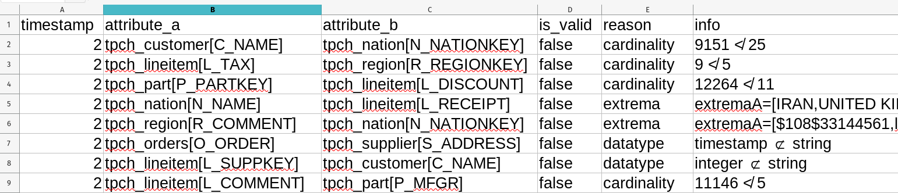

# Definition des Zielsystems

## System-Kontext

    
  
Darstellung des Systems und seines Kontexts

Das System spaltet sich in den  __Data-Generator__ und in das __Akka System__.

Die Aufgabe des __Data-Generators__ ist, ein synthetisches dynamisches Dataset von beliebiger Länge zu generieren. Dazu liest er Korpus von bestehenden Datasets aus. Die Einträge dieser Datensätze werden wiederholt, umgeordnet, gelöscht und modifiziert als Batches aus Änderungen verpackt.

Weil das Generieren dieser Batches sehr viel günstiger als ihre Analyse sein wird, werden Batches vom Empfänger gepullt statt zum Empfänger gepusht (Pull-Architektur statt Push-Architektur).

Die Aufgabe des __Akka Systems__ ist es, Batches aus Änderungen anzunehmen und das synthethische Dataset zu rekonstruieren und zu updaten. Dabei soll es fortwährend auf INDs überprüfen. Es pullt Batches vom Data-Generator so schnell, wie es sie analysieren kann.

Die gefundenen INDs werden im laufenden Betrieb in eine `live-results.csv` Datei ausgegeben. Dabei werden folgende Informationen über IND-Kandidaten festgehalten:

* `timestamp`: Der relative Zeitstempel seit Start des Programms
* `attribute_a`: Der Name des abhängige Attributs
* `attribute_b`: Der Name des referenzierten Attributs
* `is_valid`: `true` wenn der Kandidat valide ist, `false` wenn der Kandidat invalide ist
* `reason`: Der Grund warum der Kandidat als valide/invalide befunden wurde
  - `cardinality`: Purged anhand der Kardinalität (= `false`)
  - `extrema`: Purged anhand der Extremwerte (= `false`)
  - `datatype`: Purged anhand des Bloomfilters (= `false`) 
  - `bloomfilter`: Purged anhand des Bloomfilters (= `false`)
  

Sobald der Data-Generator keine Data-Batches mehr liefert, wird der finale Zustand der synthethischen Datensets analysiert und alle am Ende validen INDs werden nochmal in eine `final-results.txt` Datei ausgeben.

## Datenformat (Batches)

Ein Datenset besteht aus mehreren __Tabellen__, die unterschiedliche Schematas haben können. Diese Tabellen werden als Stream eingelesen und einzelne Einträge eines Streams (= Zeilen einer Tabelle) können ältere Einträge überschreiben.

<!--
Eine Anforderung an den Algorithmus ist, dass er _Tabellen aus ihren Batches rekonstruiert und updatet_. Dazu muss er eine Repräsentation der Tabellen über die gesamte Ausführung hinweg zwischenspeichern. 
-->

Wir konzipieren unseren Algorithmus so, dass er __Batches aus Änderungen__ einliest. Ein Batch wird immer aus genau einem Input-Stream entnommen und hat das gleiche Schema wie seine Ursprungstabelle, bis auf eine `$` Spalte am Anfang welche die _Position eines Eintrages_ beschreibt.

Änderungen lassen sich in drei Arten unterteilen:

1. Eine __Hinzufügung__ ist ein Änderung, deren Position das Erste mal im Stream auftaucht und bei der _alle Felder_ einen Wert haben.
2. Eine __Modifikation__ ist ein Änderung, deren Position bereits im Stream auftauchte und bei der _alle Felder_ einen Wert haben. Die Position muss dem Eintrag entsprechen, der überschrieben werden soll.
2. Eine __Löschung__ ist ein Änderung, deren Position bereits im Stream auftauchte und bei der _kein Feld_ einen Wert hat. Die Position muss dem Eintrag entsprechen, der gelöscht werden soll.

|$|A|B|C|
|-|--|--|--|
|200|horse|lion|flamingo|
|200|horse|lion|**parrot**|
|200||||

: Tabelle: Beispiel für eine Hinzufügung, Modifikation und Löschung eines Eintrags.

Wir definieren den leeren Zellenwert \ `NULL` als einen besonderen Marker, der die Abwesenheit eines Wertes beschreiben soll. Der `NULL` Marker muss immer von der Berechnung von Inclusion Dependencies ausgeschlossen werden - also ob ein Attribut fehlen kann oder nicht soll keine Auswirkung auf die gefundenen Inclusion Dependencies haben.

<!-- 
Während der Ausführung soll das System periodisch alle gefundenen Inclusion Dependencies ausgeben. Sollten nach dem Abarbeiten von Änderungen diese Inclusion Dependencies nicht mehr gelten, so soll das auch ausgegeben werden.
-->
