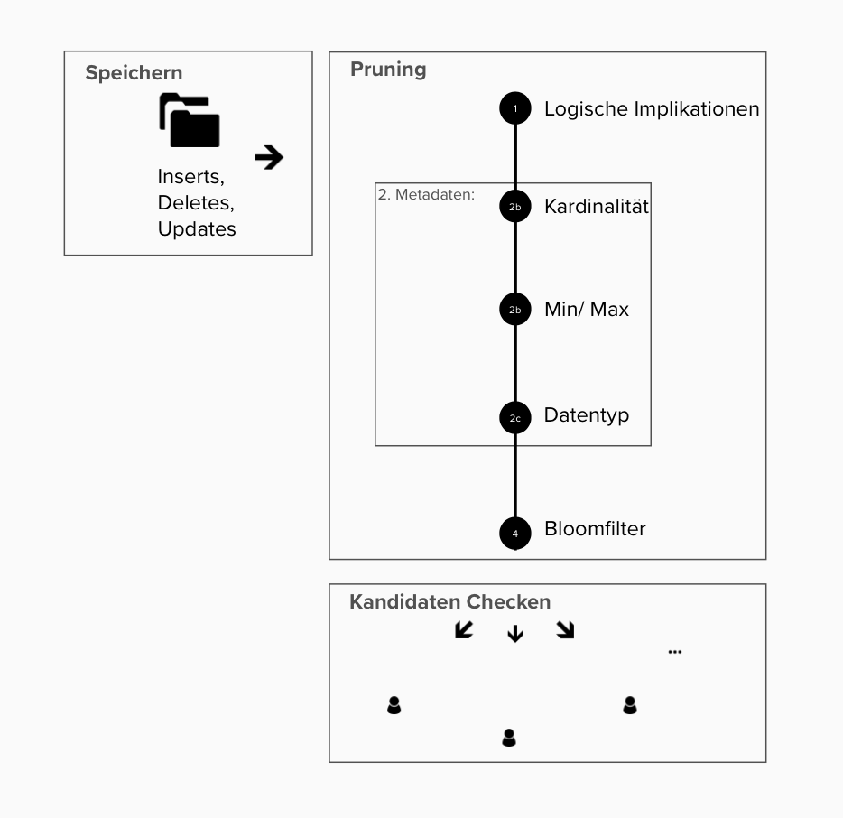

# Algorithmenentwurf

## Datenfluss

Bevor wir das Akka System mit Akka Aktoren implementieren, definieren wir den grundlegenden Datenfluss den wir umsetzen möchten.
Dieser Datenfluss muss wiederholt-ausführbar sein und mit inkrementellen Updates (Batches) arbeiten.

Wir möchten pro eingelesenes Batch möglichst wenig Operationen durchführen. Die wohl teuerste Operation ist der _Subset-Check_ für das Validieren eines IND-Kandidaten. Hierbei werden alle Werte zweier Attribute abgefragt und verglichen.
 
Unser Ziel ist es also einen Datenfluss zu definieren, der es uns erlaubt möglichst wenige Subset-Checks (oder andere teure Operationen) durchzuführen.

<p align="center">
  
  <p align="center">
   Datenfluss für inkrementelle Updates und dazugehörige Speicher
  </p>
</p>

##### 1. Read Input {-}

Es wird ein Batch von einer Quelle eingelesen. Das Format von Batches ist in der Sektion [Datenformat](#datenformat) beschrieben.

##### 2. Write Array-wise {-}

Ein Batch wird nach seinen Attributen aufgespalten und für jedes Attribut werden die Werte in ein eigenes _Column-Array_ geschrieben. Ein Column-Array ist ein Array welches alle Werte eines Attributes an ihrer jeweiligen Positionen beinhaltet.

Anschließend werden die _Delta-Counts_ berechnet. Diese beschreiben, wie häufig ein Wert eines Attributes hinzugefügt oder entfernt wurde.

Sollten alle Delta-Counts $0$ sein, so haben die Änderungen des Batches definitiv keinen Einfluss auf IND's und der Datenfluss kann vorzeitig enden.

##### 3. Write Set-wise {-}

Die Delta-Counts eines Attributs werden in das dem Attribut zugehörigen _Column-Set_ geschrieben. Ein Column-Set ist ein zählendes Set, welches mitzählt wie häufig eine Ausprägung eines Wertes in einem Column-Array auftaucht.

Beim Schreiben der Delta-Counts wird ein _Set-Diff_ erstellt. Dieses beschreibt, ähnlich dem Diff-Format des populären `diff` UNIX Tools, welche neuen Ausprägungen hinzugefügt oder entfernt wurden. 

Fällt der Zähler von $\geq 1$ auf $0$, so können wir feststellen, dass eine Ausprägung nicht mehr vorkommt (_entfernt wurde_). Gab es vorher keinen Zähler oder steigt der Zähler von \ $0$ auf $\geq 1$, so so können wir feststellen, dass eine neue Ausprägung hinzugefügt wurde.

Sollten alle Set-Diffs leer sein - also keine Ausprägungen hinzugefügt oder verändert worden sein - so haben die Änderungen keinen Einfluss auf die INDs und der Datenfluss kann vorzeitig enden.

##### 4. Update Metadata {-}

Die Set-Diffs werden benutzt, um _Metadata_ der dazugehörigen Attribute zu erstellen und zu aktualisieren.

<!--
Pro Attribut gibt es verschiedene Arten von Metadata:

* Die _Cardinality_ beschreibt die Anzahl der Ausprägungen (also die Größe des Column-Sets).
* Die _Extrema_ beschrieben die Minimum- und Maximum-Werte eines Attributes, nach lexikographischer Ordnung.
* Der _Bloomfilter_ ein probabilistischer Sketch der Ausprägungen.
-->

Mehr zu den verschiedenen Arten von Metadata im Kapitel (TODO verlinke).

##### 5. Generate Candidates {-}

Die Set-Diffs werden benutzt, um die _Candidate-Data_ aller involvierten Attribute zu erstellen und zu aktualisieren.

Für alle neuen Attribute, die bisher nicht vorkamen, werden alle möglichen neuen (unären) Kandidaten generiert.  Bereits-existierende Inclusion Dependencies, die sich geändert haben könnten, werden zurückgesetzt und neue Kandidaten generiert. 

##### 6. Purge Candidates {-}

Die generierten Kandidaten werden anhand von _Subset-Prechecking_ gefiltert. Ein Kandidat $A ⊂ B$ wird nur weiter verwendet, wenn die Metadata von A und B diese Subset-Relation erlaubt. 

Mehr zu den verschiedenen Arten von Metadata im Kapitel [Pruning Pipeline](#pruning-pipeline).

##### 7. Validate Candidates {-}

Nachdem wir in der Vorarbeit die Anzahl an Attributen, die wir auf IND's überprüfen so weit wie möglich reduziert haben, werden nun die übrig gebliebenen Kandidaten mittels _Subset-Checking_ validiert. Erst jetzt werden die Werte der Column-Sets abgerufen um die relevanten Spalten miteinander zu vergleichen.

Hierbei betreiben wir ebenfalls eine Optimierung. Wenn eine gewisse Anzahl an Werten in beiden Attributen untersucht wurde, und die Anzahl verbliebener Werte nicht mehr ausreicht um noch eine Inclusion Dependency zu ergeben, brechen wir ab.

Beispiel:

> A hat 100 einzigarte Werte, B hat 80 einzigartige Werte: Wenn in den ersten 21 Werten von A kein einziger Wert von B auftaucht, so kann B nicht mehr vollständig in A enthalten sein. Hier kann bereits abgebrochen werden.

Die Ergebnisse werden anschließend in der Candidate-Data gespeichert und für subsequente Candidate-Generation benutzt.

## Pruning Pipeline

<p align="center">
  
  <p align="center">
  Pruning Pipeline <br>
  </p>
</p>


In der Pruningphase sollen durch Vorarbeit viele mögliche Kandidaten für IND's ausgeschlossen werden. Anstatt also, dass auf der gesamten Datenmenge nach IND's gesucht wird, wird nur in den Attributen gesucht, in denen eine Abhängigkeit überhaupt in Frage kommt.

Im Status Quo suchen wir lediglich nach unären IND's. Als Fortführung könnte man nach n-ären IND's suchen.

###### Pruning durch logische Implikation {-}

Durch logische Implikationen können Kandidaten ausgeschlossen werden. Dafür werden zum Teil in vorherigen Iterationen Metadaten zu Kandidaten gespeichert.
Die logischen Implikationen sind zum Beispiel:

> TODO hier fehlen noch ein paar Implikationen

Wenn A ⊄ B: A erhält ein neues Element und B bleibt gleich => A ⊄ B.<br>
Wenn B ⊂ A: A erhält ein neues Element und B bleibt gleich => B ⊂ A.

##### Pruning durch Metadata {-}

Aus den Metadaten der Attribute kann man Landidaten ausschließen. Durch Single-Column-Analysis erhalten wir verschieden Metadaten.

<table>
<tr><th>Tabelle 1  </th><th>Tabelle 2 </th></tr>
<tr><td>

|   A | B       | C            |
| --: | :------ | :----------- |
|   1 | Mars    | Luxemburg    |
|   2 | Jupiter | Singapur     |
|   3 | Jupiter | Lichtenstein |
|   4 | Luna    | Singapur     |

</td><td>

|   X | Y    | Z      |
| --: | :--- | :----- |
|  10 | Mars | Berlin |
|  20 | Mars | Berlin |
|  30 | Luna | Berlin |

</td></tr> </table>

##### Kardinalitäten {-}

Eine Art der Metadaten sind die Kardinalitäten. Über die Anzahl von unterschiedlichen Werten kann man IND's ausschließen.

|     A     |   B   |
| :-------: | :---: |
| chihuahua |  dog  |
| chihuahua |  dog  |
| dropbear  | horse |
| elephant  |  cat  |
|  dugong   |  cat  |

```
cardinality(A)=5
cardinality(B)=3
=> A ⊄ B
```

Wenn A mehr einzigartige Werte als B hat, dann kann A nicht vollständig in B enthalten sein. Somit muss eine IND von A in B nur überprüft werden, wenn $cardinality(A) \leq cardinality(B)$. Nicht aber wenn $cardinality(A) > cardinality(B)$.

##### Extremwerte {-}

Mittels der Extremwerte eines Attribut kann man auschließen, ob eine IND besteht. Unter Extremwerte verstehen wir die Min-Werte und Max-Werte nach lexikographischer Ordnung der Werte-Strings.

Ist ein Extremwert des Attributes A in $A ⊂ B$ kleiner oder größer als die Extremwerte des Attributs B, so können wir ausschließen dass A vollständig in B enthalten ist.

##### Datentyp {-}

Weiterhin prüfen wir die Datentypen, die in einer Spalte vorkommen.

|   Metadata | Charakterisierung                                | Beispiel                                               |
| ---------: | :----------------------------------------------- | :----------------------------------------------------- |
| `datatype` | Gemeinsamer Datentyp für alle Werte einer Spalte | datatype(A) = UnsignedInteger <br>datatype(B) = String |

Mögliche Datentypen:

- `UnsignedInteger`: 1, 2, 42, 35666
- `Integer`: -10, 0, 10, 20000
- `Real`: 1, 2.0, -1.0e-7
- `Timestamp`: z.B. 2012-12-01 10:00:30
- `String`: Alle oberen und auch sonst alles, inklusive diesen Satzes.

Datentypen können andere Datentypen enthalten:

`UnsignedInteger ⊂ Integer ⊂ Real ⊂ String`
`Timestamp ⊂ String`

Sollte vor einem Subset-Check A ⊆ B A einen Datentyp haben, dessen Werte per Definition nicht in B enthalten sein können, so kann A nicht in B enthalten sein.

`datatype`(A) ⊄ `datatype`(B) ⇒ A ⊄ B

##### Bloom Filter {-}

Ein weiterer Ausschluss findet durch Nutzung von Bloomfiltern[^bloomfilter] statt. Genutzt wird ein Counting-Bloomfilter mit einer Größe von 128 und zwei Hash-Funktionen.

[^bloomfilter]: Tarkoma, Sasu, Christian Esteve Rothenberg, and Eemil Lagerspetz. "Theory and practice of bloom filters for distributed systems." IEEE Communications Surveys & Tutorials 14.1 (2011): 131-155.(#a1)

Bloomfilter sind eine probabilistische Datenstruktur, die Daten repräsentieren. Ein Bloom Filter ist ein Array aus `m` Bits, die ein Set aus `n` Elementen repräsentiert. Zu Beginn sind alle Bits auf `0`. Für jedes Element im Set werden nun `k` Hashfunktionen ausgeführt, in unserem Fall zwei, die ein Element auf eine Nummer zwischen `1` bis `m` mappen. Jede dieser Positionen im Array werden dann auf `1` gesetzt. Will man nun prüfen ob ein Element in einer Datenmenge enthalten ist, kann man die Werte berechnen und prüfen ob die Positionen auf `1` sind. Wegen Kollisionen kann das Verfahren zu False Positives führen, allerdings nicht zu False Negatives. Wenn ein Element im Array `0` ist, so wurde der Wert definitiv noch nicht gesehen.

Counting Bloomfilter ergänzen Bloomfilter dahingehend, dass nun mitgezählt wie oft ein Bit im Array auf `1` gesetzt wird. Das ermöglicht auch Elemente zu löschen. Jedes der `m` Elemente besitzt einen Counter. Wird ein Element hinzugefügt, so werden die zugehörigen counter hochgezählt, wird ein Element entfernt, so wird der Counter heruntergezählt.

