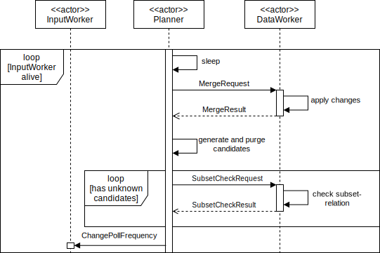
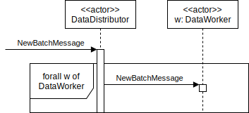

# System-Entwurf

## Datengenerator

Der Datengenerator ist eine Komposition aus den vier Klassen\  `CSVRowReader`, `RowRepeater`, `RowDeleter` und `Batcher`.

<p align="center">
  
  <p align="center">
  Beispielhafte Darstellung einer einmaligen Ausführung des Datengenerators
  </p>
</p>

Dem Datengenerator wird der Pfad einer CSV-Datei sowie eine Anzahl an Konfigurations-Parametern übergeben. Der Generator nimmt diese CSV-Datei und generiert die Batches auf die gewünschte Weise.

##### 1. CSVRowReader {-}

Dafür wird zunächst die Datei eingelesen, wobei jede Zeile in ein String-Array umgewandelt wird. Zusätzlich wird eine Spalte angefügt, in der jede Zeile fortlaufend durchnummeriert wird.

##### 2. RowRepeater {-}

Diese Zeilen-Arrays werden jetzt so lange von vorne nach hinten wiederholt bis die übergebene Anzahl an gewünschten Reihen erreicht ist.

Wenn ein `mutate` Flag gesetzt wird, wird zusätzlich nach jeder Wiederholung ein `${nth_repeat}` Postfix zu jedem Zellenwert angefügt. Also `$1` bei der 1ten Wiederholung, `$2` bei der 2ten, etc..

##### 3. RowDeleter {-}

Bei der Generierung neuer Zeilen-Arrays wird mit 10% Wahrhscheinlichkeit stattdessen eine vorherige Zeile. Dafür wird eine Array mit leerer Liste aber bekanntem Index hinzugefügt.

##### 4. RowDeleter {-}

Wenn die Anzahl an gewünschten Reihen erreicht wurde, wird daraus der Batch generiert. Dafür wird jedes Array wieder in eine String umgewandelt und die einzelnen Attribut-Werte durch Kommas getrennt. Es wird also wieder eine CSV-Datei generiert.
 

## Single-Host Akka System

<p align="center">
    
    <p align="center">
        Kommunikationsdiagramm für das versimpelte Single-Host Akka System
    </p>
</p>

Das versimpelte Single-Host Akka System dient dazu, ein erstes funktionsfähiges MVP (Minimum Viable Product) zu liefern, ohne Rücksicht auf Daten- oder Taskverteilung. Es kann dennoch dazu genutzt werden, die Korrektheit des dynamischen Algorithmus und die Funktionsweise bestimmter Aktoren zu testen.

##### InputWorker {-}

<p align="center">
    
<p align="center">Aktivitäten des InputWorker</p>
</p>

\

Der `InputWorker` spawnt pro Datenset des Korpus (also pro CSV-Datei) einen `DataGenerator`-Prozess und hat als Aufgabe, Batches zu pollen solange diese Prozesse leben. Jedes gepollte Batches wird als `NewBatchMessage` an den `DataWorker` weitergeleitet. Während der `DataWorker` diese Batch abspeichert, wartet der `InputWorker` für eine konfigurierbare Zeitdauer (gesetzt über `ChangePollFrequency`) bevor er versucht neue Batches zu pollen.

Der `InputWorker` beendet sich, sobald sich alle gespawnten `DataGenerator`-Prozesse beendet haben.

##### DataWorker {-}

<p align="center">
    
<p align="center">Parallelisierbarkeit des DataWorkers</p>
</p>

<p align="center">
    
    <p align="center">Merge-Process des DataWorkers</p>
</p>

\ 

Damit das Einlesen von Batches und das Generieren/Prüfen von Kandidaten parallel stattfinden kann, wird der `DataWorker` auf eine besondere Weise konzipiert. 

Für jedes Attribut ist der dazugehörige `AttributState` aufgeteilt in einen `current` und einen `old` Teil.
Im `current` Teil werden alle neuen Daten vorgehalten, die als Batches empfangen werden (`NewBatchMessage`). Sie werden auf Anfrage hin in den `old` Teil geschrieben (`MergeRequest`). Die Daten im `old` Teil werden verwendet um Kandidaten zu prüfen (`SubsetCheck`) und um Werte abzufragen (`SetQueryRequest`).

Diese Aufteilung in `current` und `old` ist später im [Multi-Host Akka System](#multi-host-akka-system) notwendig, um Inkonsistenzen zwischen mehreren `DataWorker` Instanzen zu vermeiden. Sie erleichtert außerdem dem `Planner` die Arbeit, sodass er immer mit dem stabilen `old` Teil statt dem volatilen `current` Teil arbeiten kann.

Wird ein Merge mittels eines `MergeRequest` angestoßen, so werden die Daten im `ColumnArray` des `current` Teils in das `ColumnArray` des `old` Teils geschrieben. Indessen wird gezählt berechnet, wie häufig ein Wert hinzugefügt oder entfernt wurde, und anschließend werden diese Delta-Counts in das `ColumnSet` des `old` Teils geschrieben. Aus dem geupdateten `ColumnSet` wird ein neues `ColumnMeta` berechnet, welches alle Metadaten des Attributs enthält, und in einem `MergeResponse` an den Requestor zurückgeschickt.

Siehe [Datenfluss](#datenfluss) für die verwendeten Datenstrukturen wie `ColumnArray`, `ColumnSet`, `ColumnMeta`.

Der `DataWorker` wird beendet, sobald sich der `Planner` beendet.

##### Planner {-}

<p align="center">
    
    <p align="center">Aktivitäten eines Planner</p>
</p>

Der `Planner` hat mehrere Aufgaben:

1. Scheduling von Merges (`MergeRequest`)
2. Generation und Purging von neuen Kandidaten
3. Scheduling von Kandidats-Prüfungen (`SubsetCheckRequest`)
4. Regulieren der Batch-Einlese-Frequenz (`UpdatePollFrequency`)
 
 Zu Beginn eines Durchlaufes schläft der `Planner` für einen konfigurierbaren Zeitraum (merge frequency), damit sich genug Änderungen im `DataWorker` ansammeln.

Als Nächstes sendet er einen `MergeRequest` an den `DataWorker` und wartet auf alle `MergeResponse`s, welche die geupdateten Attributes und ihre Metadaten beschreiben.

Die geupdateten Attributes und ihre Metadaten werden abgespeichert. Dann werden aus den neuen Attributen alle neuen IND-Kandidaten generiert und aus allen geupdaten Attributen alle Kandidaten re-generiert, die sich potentiell geändert haben könnten.

Alle generierten Kandidaten werden anhand ihrer Metadaten in einer [Purging-Pipeline](#purging-pipeline) gefiltert. Die gepurgten Kandidaten werden in der `live-results.csv` vermerkt. Nur die verbliebenen Kandidaten müssen noch geprüft werden.

Für jeden zu-prüfenden Kandidaten wird ein `SubsetCheckRequest` an den `DataWorker` gesendet und das entsprechende `SubsetCheckResult` abgewartet. Die Ergebnisse werden gespeichert und in der `live-results.csv` ausgegeben.

Zuletzt wird die dynamische Batch-Einlese-Frequenz berechnet und als `ChangePollFrequency` an den `InputWorker` gesendet.

> **Hinweis**: Wir haben bisher keine zufriedenstellende Heuristik für die Berechnung der Batch-Einlese-Frequenz gefunden. Daher wird die Batch-Einlese-Frequenz derzeit als Kommandozeilen-Parameter übergeben und bleibt konstant.

Der `Planner` beendet sich, sobald der `InputWorker` sich beendet. Mit dem Beenden des `Planner`s wird das gesamte Akka System beendet.


## Multi-Host Akka System

<p align="center">
    
<p align="center">Kommunikationsdiagramm für das verteilte Multi-Hosts Akka System</p>
</p>

Das komplexere Multi-Host Akka System das finale Produkt unserer Entwicklung. Nachdem die `Planner`, `InputWorker` und `DataWorker` Aktoren im versimpelten Single-Host Akka System entwickelt und geprüft wurden, wird es mittels eines `DataDistributor` Aktor erweitert.  Dieser `DataDistributor` hat das selbe Interface wie ein \ `DataWorker`, delegiert aber auf mehrere `DataWorker` die möglicherweise auf unterschiedlichen Hosts laufen.

##### DataDistributor {-}

Zu Beginn wird der `DataDistributor` mit einer fixen Anzahl an `DataWorker`-Referenzen konstruiert. Weitere `DataWorker` können sich im Lauf der Ausführung registrieren.

Für den `InputWorker` und den `Planner` muss der `DataDistributor` die identische Funktionalität liefern wie ein `DataWorker`. Intern muss der `DataDistributor` Anfragen auf auf verschiedene Weisen abhandeln und die Arbeit zwischen mehreren `DataWorker` koordinieren.

<p align="center">
    
<p align="center">Abhandlung einer NewBatchMessage an den DataDistributor</p>
</p>

Im Falle einer `NewBatchMessage` wird das Batch gemäß Modulo-Partitionierung vertikal (= spaltenweise) aufgeteilt und als kleinere `NewBatchMessage` an die zuständigen `DataWorker` weitergeleitet. Es wird gespeichert, welche `DataWorker` für welche Attribute zuständig sind.

<p align="center">
    
<p align="center">Abhandlung eines MergeRequest an den DataDistributor</p>
</p>

Im Falle eines `MergeRequest` wird ein `MergeRequest` an alle `DataWorker` weitergeleitet. Sobald alle mit einem `MergeResponse` geantwortet haben, wird ein `MergeResponse` zurückgesendet welches die Informationen aller `DataWorker` verpackt.

<p align="center">
    
<p align="center">Abhandlung eines SubsetCheckRequest an den DataDistributor</p>
</p>

Im Falle eines `SubsetCheckRequest` wird ein `SubsetCheckRequest` an den `DataWorker` gesendet, der für das referenzierte Attribut zuständig ist. Falls ein anderer `DataWorker` für das abhängige Attribut zuständig ist, so wird eine Referenz zu diesem dem `SubsetCheckRequest` angehangen.

Jetzt wird zwischen zwei Fällen unterschieden:

1. Empfängt der `DataWorker` ein `SubsetCheckRequest` ohne Referenz auf einen anderen `DataWorker`, so führt er den Subset-Check direkt auf den beiden `AttributeState`-Instanzen der Attribute aus.
2. Empfängt der `DataWorker` ein `SubsetCheckRequest` mit Referenz auf einen anderen `DataWorker`, so fragt er die Werte des abhängigen Attributs von diesem in einer Schleife ab. Werte werden abgefragt, bis eine Subset-Beziehung zwischen den Wertemengen auschlossen werden kann oder bis alle Werte abgefragt wurden (und eine Subset-Beziehung besteht).

In beiden Fällen wird das Ergebnis als `SubsetCheckResponse` direkt an den Requestor zurückgesendet, dessen Aktor-Referenz im `SubsetCheckRequest` mitgeführt wird.

<!--
## Value Representation

### Hashing Long Values

Für lange Values kann stattdessen nur ein Hash gespeichert werden. Dadurch wird Speicher und Netzwerklast eingespart.

```
"foo" => "foo"
"bar" => "bar"
"Lorem ipsum {...}" => $124$cb24d439cebabab24
```

Indem wir mit dem Hash die Quell-Länge speichern (`${LEN}${HASH}`), erhöhen wir die Kollisionsresistenz noch ein wenig. Weiter könnte die Länge noch für die Single-Column-Analysis hilfreich sein. 

### Faster Hash Algorithm

Java's Builtin Hashing (4 byte) ist ob der hohen Kollisionsgefahr ungeeignet für Datenmengen unserer Größe.

Neben Algorithmen der SHA-Familie könnten wir auch [xxHash](https://github.com/Cyan4973/xxHash) oder [MurmurHash](https://en.wikipedia.org/wiki/MurmurHash) verwenden.

### Byte Array Values

Statt Java's Builtin `String` Klasse, die mit ihren eigenen Problemen kommt (potentiell UTF-16 sowie Klassenoverhead), können wir Values im UTF-8 Format als `byte[]` behandeln.

## Smart Candidate Generation

### Elimination-by-Implication

Wenn bereits Kandidaten geprüft wurden, können die Ergebnisse genutzt werden, andere Kandidaten direkt auszuschließen.

```
A c B  /\    B c D  ->   A c D
A c B  /\  !(A c D) -> !(B c D)
```

### Candidate Picking

Statt dass sofort alle Kandidaten generiert und geprüft werden, wird nur eine bestimmte Anzahl von Candidaten generiert, um von den Prüfungs-Ergebnissen nutzen zu machen.

Die gewählten Kandidaten können zufällig sein oder bewusst gewählt, um die potentielle Nützlichkeit der Ergebnisse zu erhöhen. 

Im Idealfall könnten z.B. drei Candidate-Checks zwischen vier Attributen dazu führen, dass man drei andere Candidate-Checks eliminieren kann. 


### Candidate Flagging

Nicht immer, wenn sich ein Column-Set verändert hat, müssen alle assoziierte Candidate-Checks neu ausgeführt werden. 

* Counterexamples

## Single-Column-Analysis Prechecking

Wenn wir bestimmte Eingenschaften einer Column kennen, können wir für einen Candidate-Check vorzeitig ein True-Negative zurückliefern.

* Distinct Value Count
* Datatype (Data Domain)
* Bloomfilter
* Minima/Maxima
* Column-Bytesum

Fraglich ist, wo dieser Filter angebracht werden sollte - vor oder nach der Candidate-Generation. Davor: Candidaten können früher eliminiert werden. Danach: Möglicherweise kostenspielig bei sehr vielen Attributen.

## Optimierte Subset-Checks

### Dirty-Ranges

Beim verändern von Werten eines Sets können dynamische Dirty-Ranges eingesetzt werden. 

... (ähnlich wie Dirty-Flag, aber für eine Range)

### Early-Return

Basierend auf den Distinct Value Counts kann die Iteration eines Subset-Check frühzeitig abgebrochen werden.

### Bidirectional Check

Wenn `A c B` geprüft wird, können wir bei bedarf auch direkt `B c A` in einer Iteration prüfen.

-->
