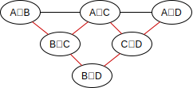

# System-Entwurf

## Datengenerator

Der Datengenerator ist eine Komposition aus den vier Klassen\  `CSVRowReader`, `RowRepeater`, `RowDeleter` und `Batcher`.

<p align="center">
  
  <p align="center">
  Beispielhafte Darstellung einer einmaligen Ausführung des Datengenerators
  </p>
</p>

> TODO: Können wir (5) entfernen?

#### 5. Datengenerator {-}

Dem Datengenerator wird der Pfad Adresse einer CSV-Datei und die Anzahl an Reihen die insgesamt ausgegeben werden sollen, übergeben. Der Generator nimmt diese CSV-Datei und generiert daraus einen Batch.

> TODO: Das ist noch nicht alles - es gibt mehr Parameter!

##### 1. CSVRowReader {-}

Dafür wird zunächst die Datei eingelesen, wobei jede Zeile in ein String-Array umgewandelt wird. Zusätzlich wird eine Spalte angefügt, in der jede Zeile fortlaufend durchnummeriert wird.

##### 2. RowRepeater {-}

Diese Zeilen-Arrays werden jetzt so lange von vorne nach hinten wiederholt bis die übergebene Anzahl an gewünschten Reihen erreicht ist.

##### 3. RowDeleter {-}

Bei der Generierung neuer Zeilen-Arrays wird mit 10% Wahrhscheinlichkeit stattdessen eine vorherige Zeile. Dafür wird eine Array mit leerer Liste aber bekanntem Index hinzugefügt.

##### 4. RowDeleter {-}

Wenn die Anzahl an gewünschten Reihen erreicht wurde, wird daraus der Batch generiert. Dafür wird jedes Array wieder in eine String umgewandelt und die einzelnen Attribut-Werte durch Kommas getrennt. Es wird also wieder eine CSV-Datei generiert.
 

## Single-Host Akka System

<p align="center">
    
    <p align="center">
        Kommunikationsdiagramm für das versimpelte Single-Host Akka System
    </p>
</p>

Das versimpelte Single-Host Akka System dient dazu, ein erstes funktionsfähiges MVP (Minimum Viable Product) zu liefern, ohne Rücksicht auf Daten- oder Taskverteilung. Es kann dazu genutzt werden, die Korrektheit des dynamischen Algorithmus zu prüfen und die Funktionsweise bestimmter Aktoren zu testen.

\ 

<p align="center">
    
</p>

\

Der `InputWorker` spawnt pro Datenset des Korpus (also pro CSV-Datei) einen `DataGenerator`-Prozess und hat als Aufgabe, Batches zu pollen solange diese Prozesse leben. Jedes gepollte Batches wird als `NewBatchMessage` an den `DataWorker` weitergeleitet. Während der `DataWorker` dieses Batch speichert, wartet der `InputWorker` für eine konfigurierbare Zeitdauer (`AdjustPollFrequency`) bevor er versucht neue Batches zu pollen.

\ 

<p align="center">
    
</p>

## Multi-Host Akka System


<!--

## Value Representation

### Hashing Long Values

Für lange Values kann stattdessen nur ein Hash gespeichert werden. Dadurch wird Speicher und Netzwerklast eingespart.

```
"foo" => "foo"
"bar" => "bar"
"Lorem ipsum {...}" => $124$cb24d439cebabab24
```

Indem wir mit dem Hash die Quell-Länge speichern (`${LEN}${HASH}`), erhöhen wir die Kollisionsresistenz noch ein wenig. Weiter könnte die Länge noch für die Single-Column-Analysis hilfreich sein. 

### Faster Hash Algorithm

Java's Builtin Hashing (4 byte) ist ob der hohen Kollisionsgefahr ungeeignet für Datenmengen unserer Größe.

Neben Algorithmen der SHA-Familie könnten wir auch [xxHash](https://github.com/Cyan4973/xxHash) oder [MurmurHash](https://en.wikipedia.org/wiki/MurmurHash) verwenden.

### Byte Array Values

Statt Java's Builtin `String` Klasse, die mit ihren eigenen Problemen kommt (potentiell UTF-16 sowie Klassenoverhead), können wir Values im UTF-8 Format als `byte[]` behandeln.

## Smart Candidate Generation

### Elimination-by-Implication

Wenn bereits Kandidaten geprüft wurden, können die Ergebnisse genutzt werden, andere Kandidaten direkt auszuschließen.

```
A c B  /\    B c D  ->   A c D
A c B  /\  !(A c D) -> !(B c D)
```

### Candidate Picking

Statt dass sofort alle Kandidaten generiert und geprüft werden, wird nur eine bestimmte Anzahl von Candidaten generiert, um von den Prüfungs-Ergebnissen nutzen zu machen.

Die gewählten Kandidaten können zufällig sein oder bewusst gewählt, um die potentielle Nützlichkeit der Ergebnisse zu erhöhen. 

Im Idealfall könnten z.B. drei Candidate-Checks zwischen vier Attributen dazu führen, dass man drei andere Candidate-Checks eliminieren kann. 



### Candidate Flagging

Nicht immer, wenn sich ein Column-Set verändert hat, müssen alle assoziierte Candidate-Checks neu ausgeführt werden. 

* Counterexamples

## Single-Column-Analysis Prechecking

Wenn wir bestimmte Eingenschaften einer Column kennen, können wir für einen Candidate-Check vorzeitig ein True-Negative zurückliefern.

* Distinct Value Count
* Datatype (Data Domain)
* Bloomfilter
* Minima/Maxima
* Column-Bytesum

Fraglich ist, wo dieser Filter angebracht werden sollte - vor oder nach der Candidate-Generation. Davor: Candidaten können früher eliminiert werden. Danach: Möglicherweise kostenspielig bei sehr vielen Attributen.

## Optimierte Subset-Checks

### Dirty-Ranges

Beim verändern von Werten eines Sets können dynamische Dirty-Ranges eingesetzt werden. 

... (ähnlich wie Dirty-Flag, aber für eine Range)

### Early-Return

Basierend auf den Distinct Value Counts kann die Iteration eines Subset-Check frühzeitig abgebrochen werden.

### Bidirectional Check

Wenn `A c B` geprüft wird, können wir bei bedarf auch direkt `B c A` in einer Iteration prüfen.

-->
