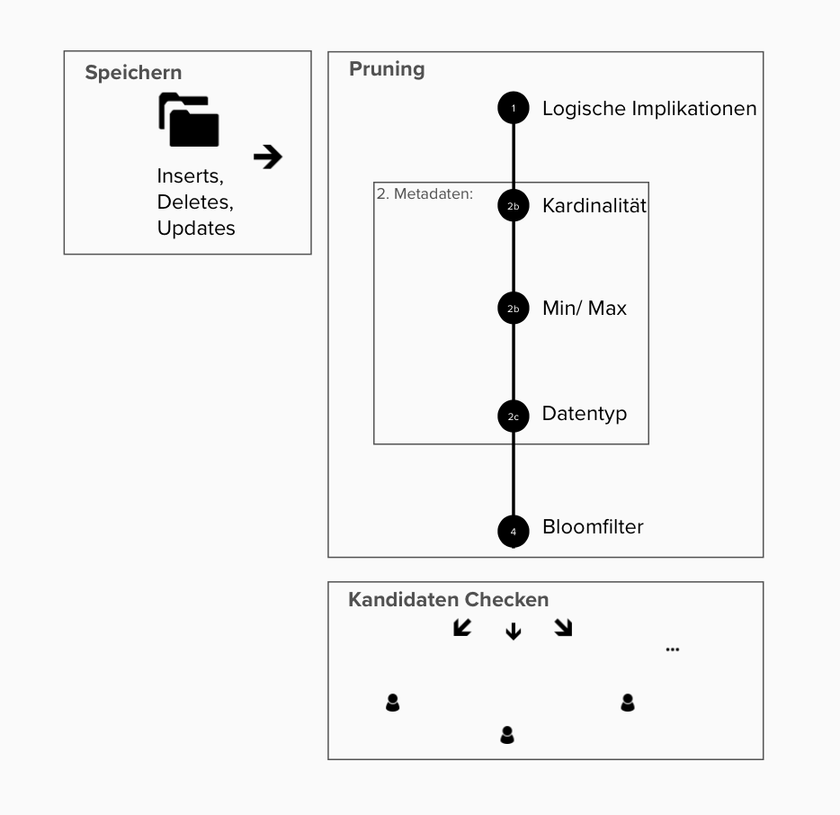

# Algorithmenentwurf

Die Inserts, Updates und Deletes werden zunächst gespeichert.

## Pruning

In der Pruningphase sollen durch Vorarbeit viele mögliche Permutationen für Inclusion Dependencies ausgeschlossen werden. Anstatt also, dass auf der gesamten Datenmenge nach Inclusion Dependencies gesucht wird, wird nur in den Attributen gesucht, in denen eine Abhängigkeit überhaupt in Frage kommt. Im Status Quo suchen wir lediglich nach unären Inclusion Dependencies. Als Fortführung könnte man nach n-ären Inclusion Dependencies suchen.

In einer Pipeline werden nacheinander durch verschiedene Prüfungen Permutationen ausgeschlossen.

1. Logische Implikation
   Durch Logische Implikationen können Permutationen ausgeschlossen werden. Dafür werden zum Teil in vorherigen Iterationen Metadaten zu Permutationen gespeichert.
   Die Logischen Implikationen sind zum Beispiel:
   Wenn A keine Inclusion Dependecy von B: A erhält ein neues Input und B bleibt gleich, dann kann A immer noch kein Inclusion Dependency sein.

2. Aus den Metadaten der Attribute kann man auch Permutationen ausschließen.

- a) Kardinalitäten
  Wenn A mehr einzigartige Werte als B hat, dann kann A nicht in B enthalten sein. Somit muss eine Inclusion Dependency von A in B nur überprüft werden, wenn |A|<|B| oder |A|=|B|. Nicht aber wenn |A|>|B|.

- b) Min-/Max-Werte
  Für die Extremwerte in einem Attribut kann man überprüfen ob eine Inclusion Dependency besteht. Wenn der Maxwert von A größer ist als der Maxwert von B, so enthält A Werte die es nicht in B gibt, also kann A nicht in B enthalten sein, B aber in A. Dasselbe gilt für den Minwert. Wenn der kleinste Wert in A kleiner ist als in B, kann A nicht in B enthalten sein. B aber in A. Somit können bei allen Kombinationen von Inclusion Dependencies die Min- und Maxwerte überprüft werden.

- c) Datentyp
  Wenn A Datentypen enthält, die es nicht in B gibt, dann kann A nicht in B sein.

3. Bloom Filter

Ein weiterer Ausschluss findet durch Nutzung von Bloom Filtern statt. Genutzt wird ein Counting-Bloomfilter mit einer Größe von 128 und zwei Hash-Funktionen. Bloomfilter sind eine probabilistische Datenstruktur, die Daten repräsentieren. Ein Bloom Filter ist ein Array aus m bits, die ein Set aus n Elementen repräsentiert. ZU Beginn sind alle bits auf null. Für jedes Element im Set werden nun k Hashfunktionen ausgeführt, die ein Element auf eine Nummer zwischen eins bis m mappen. Jede dieser Positionen im Array werden dann auf eins gesetzt. Will man nun prüfen ob ein Element in einer Datenmenge enthalten ist, kann man die Werte berechnen und prüfen ob die Positionen auf eins sind. Wegen Kollisionen kann das Verfahren zu False Positives führen. Allerdings nicht zu False Negatives. Wenn ein Element im Array auf Null ist, so wurde der Wert definitiv noch nicht gesehen.

Counting Bloomfilter ergänzen Bloomfilter dahingehend, dass nun mitgezählt wie oft, ein Bit im Array auf eins gesetzt wird. Das ermöglicht auch Elemente zu löschen.

https://citeseerx.ist.psu.edu/viewdoc/download?doi=10.1.1.457.4228&rep=rep1&type=pdf

## Kandidaten Checken

Nachdem wir in der Vorarbeit die Anzahl an Attributen, die wir auf Inclusion Dependencies überprüfen so weit wie möglich reduziert haben, werden nun die übrig gebliebenen Permutationen überprüft. Erst jetzt werden die gespeicherten Tabellen abgerufen um die relevanten Spalten miteinander zu vergleichen.
Hierbei betreiben wir ebenfalls eine Optimierung. Wenn eine gewisse Anzahl an Werten in beiden Attributen untersucht wurde, und die Anzahl verbliebener Werte nicht mehr ausreicht um noch eine Inclusion Dependency zu ergebn, brechen wir ab. Beispiel:
A hat 100 einzigarte Werte, B hat 80 einzigartige Werte: Wenn in den ersten 21 Werten von A kein einziger Wert von B auftaucht, so kann B nicht mehr vollständig in A enthalten sein. Hier kann bereits abgebrochen werden.
