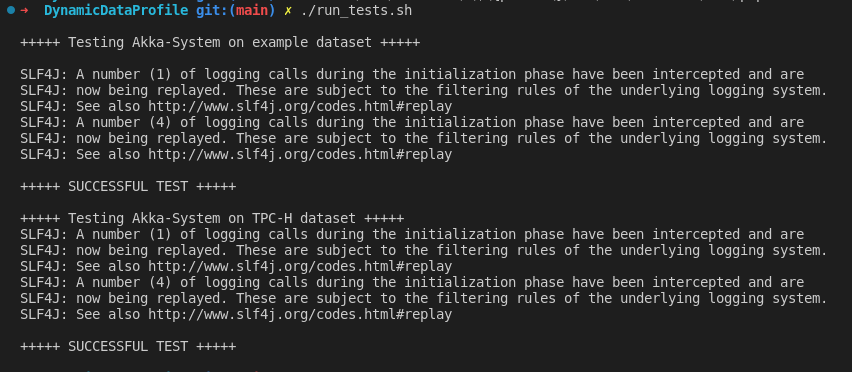

# Entwicklerdokumentation

## Projektstruktur

* `scripts/`: Hier befindet sich derzeit nur das `datagenerator.py` Skript.
* `src/main/java/de/ddm/actors/profiling/`: Hier befinden sich alle unsere Aktoren für unser Aktoren-Protokoll.
* `src/main/java/de/ddm/structures`: Hier befinden sich alle unsere Klassen, die nicht direkt von Akka abhängig sind.
* `src/main/java/de/ddm/configuration`: Hier können die Kommandozeilen-Befehle des Akka-Systems angepasst werden.
* `ddm-akka/`: Hier befindet sich eine alte Version unserer Codebase, die für das Testen verwendet wird.
* `ddm-spark/`: Hier befindet sich eine Implementation des SINDY-Algorithmus in Spark.

## Testen

Wir testen die Ergebnisse mittels dem `run_tests.sh` Skript.

Dabei testen wir unserer neuen Codebase gegen die Ergebnisse einer alte Version unserer Codebase.  Diese alte Version befindet sich in der Unter-Repository `ddm-akka`.  Unsere Tests prüfen derzeit nur, ob alle INDs in einem statischen Datensatz korrekt gefunden wurde. Für dynamische Datensätze haben wir derzeit keine Tests.

Bei unserem Test werden die beiden Output-Dateies `final-results.txt` und `ddm-akka/results.txt` verglichen. Beiden Dateien werden mittels dem UNIX `diff` Tool auf Gleichheit geprüft: `sort ddm-akka/results.txt | diff final-results.csv -`. Bei gescheiterten Tests werden die nicht-gefunden und falsch-gefunden Einträge hervorgehoben.

